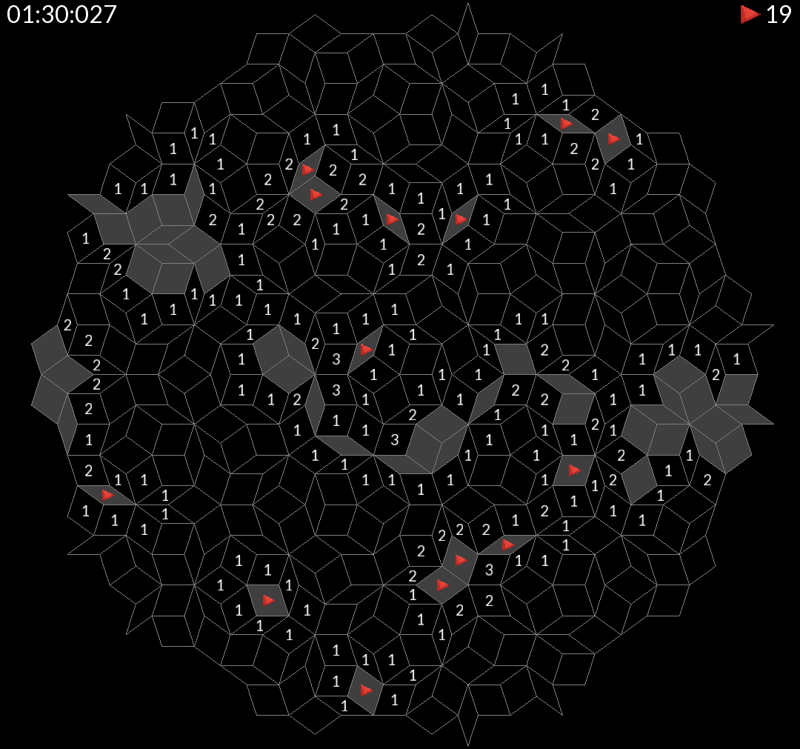

# Penrose Sweeper

## About the Game

Penrose Sweeper is a unique puzzle game inspired by the classic Minesweeper, but set on a non-periodic Penrose tiling board. Players must uncover all safe tiles without triggering hidden mines, using logic and deduction. The game features multiple difficulty levels and board sizes, offering a fresh challenge for both new and experienced players. With its distinctive geometric layout and strategic gameplay, Penrose Sweeper provides a modern twist on a timeless classic.
